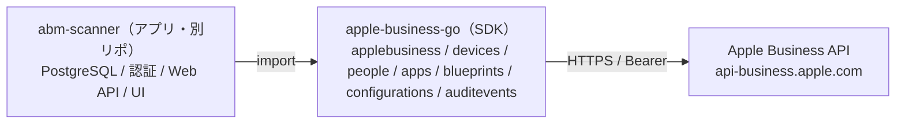

# ROADMAP — apple-business-go（SDK）

ローカルでの継続開発に向けた方針・ロードマップ・着手順・要確認事項。
（アプリ `abm-scanner` は別リポジトリ。末尾に概要のみ記載。）

---

## 1. 設計方針

2モジュール構成。依存は **アプリ → SDK の一方向**で、SDK はアプリを一切知りません。

**原則**
- SDK は「薄く・汎用的に」。アプリ都合の機能（DB・画面・キャッシュ）は入れない。
- 認証/通信は `applebusiness` コアに集約。Apple Business の4本柱（device / people / **brand** / support）に対応し、
  柱が増えてもコアは不変、パッケージを足すだけ。
- アプリは SDK をバージョン固定で取り込む（`require`）。破壊的変更は SemVer で管理。

---

## 2. 現在の到達点（Done）

| 区分 | 項目 | 状態 |
|---|---|---|
| `applebusiness` | OAuth2（ES256 JWT）/ リトライ / ページング / JSON:API / 汎用ヘルパ（List/Get/Relationship/Create/Update/Delete/ModifyRelationship） | ✅ |
| `devices` | orgDevices / mdmServers / appleCareCoverage / 割り当て・解除アクティビティ / mdmDevices（一覧・詳細） | ✅ |
| `people` | users / userGroups | ✅ |
| `apps` | apps / packages（読み取り） | ✅ |
| `blueprints` | CRUD + リレーション操作（add=POST / remove=DELETE / replace=PATCH） | ✅ |
| `configurations` | CRUD（CUSTOM_SETTING、`configurationProfile`=Base64） | ✅ |
| `auditevents` | List（共通エンベロープ + `eventData` + `Payload`、主要イベント型同梱） | ✅ |
| データ型 | 全フィールド・列挙値・監査モデルを公式 DocC で確認し、`docs/apple-business-api-datatypes.md` に集約。各 `Attributes` をこれに一致 | ✅ |
| その他 | examples / CI 雛形 / `docs/dev/CLAUDE.md` / `ROADMAP.md` / `docs/dev/CLAUDE_CODE_PROMPT.md` / `v0.1.0` タグ | ✅ |

> ⚠️ この開発環境に Go ツールチェーンが無く **未ビルド**。ローカルで `go mod tidy && go build ./... && go vet ./...` を最初に通すこと。

---

## 3. SDK のロードマップ

### 3.1 ビルド健全化 & テスト & 品質（最優先）
- [ ] `go mod tidy`（`go.sum` 生成）/ `go build ./...` / `go vet ./...` / `gofmt -l .` を緑に
- [x] コアの単体テスト（`applebusiness/client_test.go`、`httptest`）: トークン交換 / GET / ページング / `ListSeq` / Create・Update・Delete / relationship / エラーデコード / 429リトライ / 型付き判定
- [x] 各ドメインパッケージの単体テスト（devices: 読み取り+activities, people, apps, blueprints: CRUD+relationship, configurations: CRUD, auditevents: ListRange+Payload）
- [x] `auditEvents` 全 `eventData` 型付け + `AuditEventType` 定数33種
- [x] `examples/write-test`（全書き込みAPIの安全な動作確認CLI）
  - 書き込みボディ（`activityType`、`{data:[{type,id}]}`、`customSettingsValues`）
  - `auditevents` の `UnmarshalJSON`（共通項目 + `eventData*` 収集）/ `Payload`
- [ ] `golangci-lint` 導入、`go test -race` を CI に追加、`go doc` 用 Example

### 3.2 実装状況（パッケージ別）
| パッケージ | 内容 | 状態 |
|---|---|---|
| `applebusiness` | コア（認証/通信/ページング/リトライ/汎用ヘルパ） | 実装済み |
| `devices` | orgDevices / mdmServers / appleCareCoverage / activities（割り当て・解除） / mdmDevices（一覧・詳細） | 実装済み |
| `people` | users / userGroups | 実装済み |
| `apps` | apps / packages（読み取り） | 実装済み |
| `blueprints` | CRUD + リレーション操作 | 実装済み |
| `configurations` | CRUD（CUSTOM_SETTING） | 実装済み |
| `auditevents` | List（共通エンベロープ + eventData） | 実装済み |

※ フィールド名・列挙値・監査モデルは公式 DocC で確認済み（`docs/apple-business-api-datatypes.md`）。
　残作業は主にテスト（§3.1）と設計の磨き込み（§3.4）。

### 3.3 Blueprints / Configurations（組み込みデバイス管理）— 確定仕様

**背景**: Apple Business では MDM が組み込み・無料化され、**Blueprints** と **Configurations** が利用可能。
Configurations はセキュリティ/ネットワーク等の設定単位、Blueprints は **apps・configurations・packages を束ねて
デバイス/ユーザー/グループへ割り当てる**ゼロタッチ展開の単位（「一度作れば全体へ展開」）。

**読み取り**
| メソッド | エンドポイント |
|---|---|
| `blueprints.List` / `Get` / `RelationshipIDs` | `/v1/blueprints(/{id})(/relationships/{rel})` |
| `configurations.List` / `Get` | `/v1/configurations(/{id})` |

**書き込み（確定。詳細・ボディは reference §7）**
| 操作 | エンドポイント |
|---|---|
| Blueprint 作成 / 更新 / 削除 | `POST /v1/blueprints`、`PATCH` / `DELETE /v1/blueprints/{id}` |
| Blueprint への割り当て（デバイス/グループ/ユーザー/アプリ/構成/パッケージ） | `POST`(追加)・`DELETE`(削除)・`PATCH`(置換) `/v1/blueprints/{id}/relationships/{orgDevices\|userGroups\|users\|apps\|configurations\|packages}`（body `{data:[{type,id}]}`） |
| Configuration 作成 / 更新 / 削除 | `POST /v1/configurations`、`PATCH` / `DELETE /v1/configurations/{id}` |
| デバイスへの「適用」 | 専用操作は無く、Blueprint の `orgDevices` リレーションへの追加で割り当てる（MDM の `orgDeviceActivities` とは別系統） |

**注意**: `GET .../relationships/{rel}` は権限/状態により 403 になり得る → 割り当て状態はアプリ側でも保持する設計が無難。
破壊的操作（削除・割り当て変更）はアプリ層で **admin限定 + 監査**。

### 3.4 API設計の磨き込み
- [x] Functional Options（`WithBaseURL` / `WithTokenURL` / `WithMaxRetries` / `WithUserAgent` / `WithHTTPClient`）
- [x] 型付きエラー判定（`IsNotFound` / `IsRateLimited` / `IsUnauthorized` / `IsForbidden` / `IsConflict`）
- [x] ページングのイテレータ `ListSeq`（Go 1.23 range-over-func。全件メモリ展開を回避。既存 `List` は維持）
- [ ] 書き込みリトライの冪等性レビュー（POST 二重実行の回避）
- [ ] トークン/assertion の永続キャッシュ用インタフェース（既定メモリ、差し替え可能）

### 3.5 任意の拡張
- [ ] 監査イベントの残り `eventData` 型（全33種のうち未型付け分。datatypes.md §4.3 準拠）
- [x] `MdmDevice` / `MdmDeviceDetail` のエンドポイント配線: `GET /v1/mdmDevices`（`ListMdmDevices`）/ `GET /v1/mdmDevices/{id}/details`（`MdmDeviceDetails`）。
  公式 DocC で確定（API v2.0 で追加）。旧推測の `/v1/mdmServers/{id}/devices` というエンドポイントは存在しない
- [ ] `brand`（旧 Apple Business Connect）パッケージ（将来）。実在するが **公開仕様（エンドポイント/データ型/DocC）が無い**。認証も device API と別系統（Service Account ＋ Partner Organization 委譲、Organization/Marketing Administrator ロール）。実装には Onboarding Guide の入手か、委譲設定済み組織での実機確定が前提（2026-06 調査。参考: support.apple.com/guide/business/brands-api-access-abcb4226f877/web）
- [ ] `support` パッケージ（将来）

### 3.6 リリース / バージョニング
- [ ] SemVer（形が固まるまで `v0.x`）。`git push --tags` で公開。**リポジトリ名はモジュールパス `apple-business-go` と一致**させる
- [ ] `CHANGELOG.md`（Conventional Commits 推奨）、`README` バッジ（pkg.go.dev / CI）

---

## 4. 未確定 / 本番前に Apple 公式で要確認

- [x] `mdmServers` の割り当てデバイス: `relationships/devices`（linkage＝`{type:orgDevices,id}`）のみ可。related `…/devices` は `GET_RELATED` 不可（GET_RELATIONSHIP のみ）。フル属性は `orgDevices/{id}` を個別取得。単体 `GET /v1/mdmServers/{id}` も不可（GET_COLLECTION のみ）。実APIで確認。
- [ ] 旧来「不可」とされた操作（デバイス release、移行期限、MDMトークン更新）の現在の可否

> 解決済み: OAuth 方式（token端点=`/auth/oauth2/token`、アサーション `aud`=`/auth/oauth2/v2/token`、`iss`=team_id（=client_id）、ES256、scope、180日/60分。Web で確認済み）/
> `MdmDevice` / `MdmDeviceDetail` の取得エンドポイントは `GET /v1/mdmDevices` / `GET /v1/mdmDevices/{id}/details`（API v2.0 で追加。公式 DocC で確定。`/v1/mdmServers/{id}/devices` という related エンドポイントは存在しない）/
> auditEvents の必須クエリ `filter[startTimestamp]`（+ `filter[endTimestamp]`、ISO8601。実APIで確認）/
> アクティビティ status `IN_PROGRESS`→`COMPLETED`（部分失敗でも COMPLETED）・subStatus `COMPLETED_WITH_ERROR`（実APIで確認。PollActivity は処理中以外を終了とみなす）/
> フィールド名（userGroup の `type` 等）/ 列挙値 / 監査イベントモデル /
> Blueprints・Configurations の書き込み仕様（`docs/apple-business-api-datatypes.md`, reference §7-§8 で確定）。

---

## 5. 参考

- データ型一次情報: `docs/apple-business-api-datatypes.md`（列挙21・属性12種・オブジェクト67・監査機構）
- API 定義リファレンス: `docs/apple-business-api-reference.md`（§7 書き込み仕様 / §8 公式確認済み）
- 参照した公開実装（独自再実装の参考。コードの直接流用なし）:
  `micromdm/nanoaxm` (Go), `neilmartin83/terraform-provider-axm` (Go),
  `rodchristiansen/asbmutil` (Swift), `EUCTechTopics/PSABM` (PowerShell) 等

---

## 付録: アプリ（abm-scanner / 別リポジトリ）の概要

SDK を `import` する Web アプリ。PostgreSQL 永続化 / 認証（Argon2id・サーバセッション）/ AES-256-GCM で `.pem` 暗号化 /
Apple→DB 同期 / 3ペインUI / 書き込み（割り当て・Blueprint 操作）は admin限定 + 監査。
Phase: 1 store(pgx) → 2 認証 → 3 読み取りAPI(最小) → 4 sync → 5 React 3ペインUI → 6 運用。
横断: 秘密鍵は KMS/env、書き込みは admin限定 + 全件監査、SDK はバージョン固定で取り込む。
